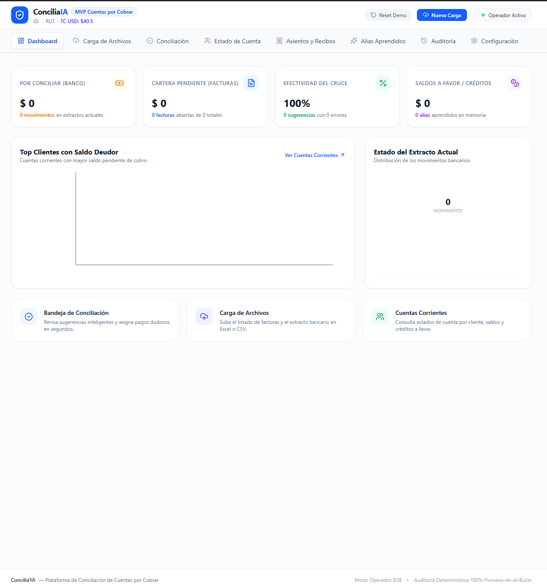
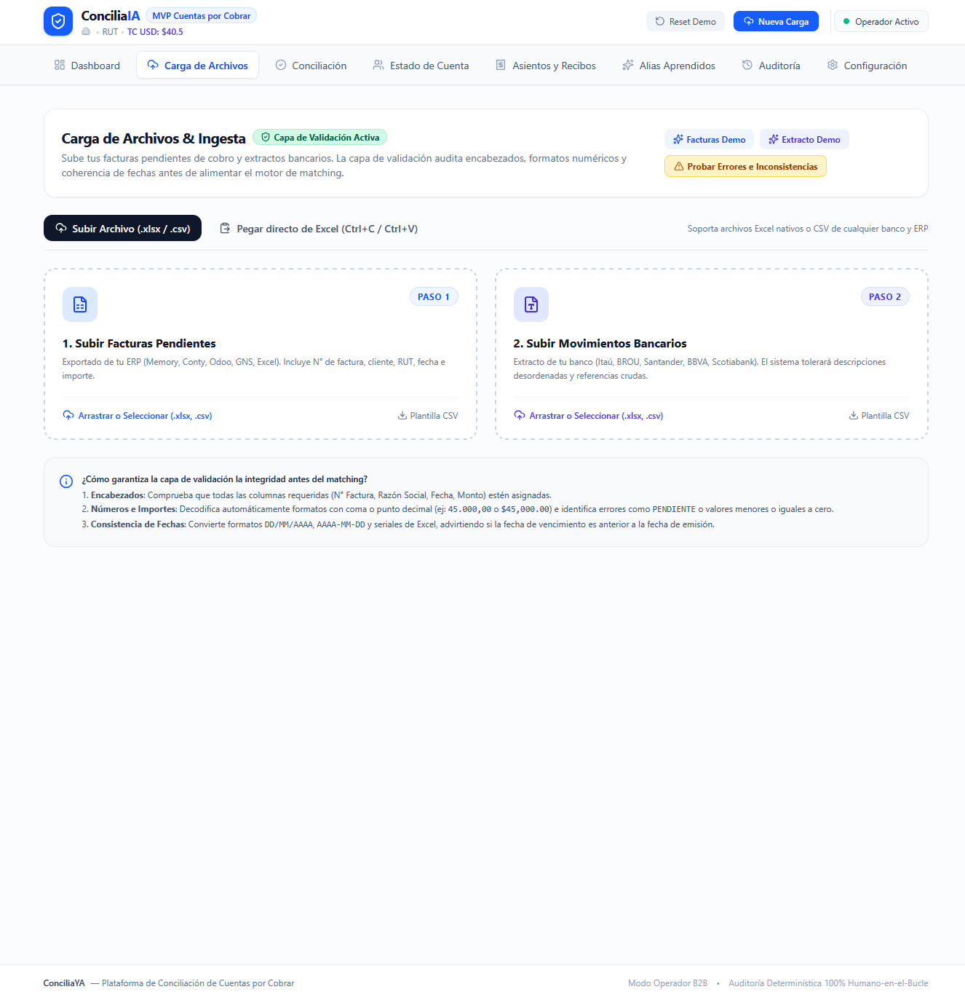
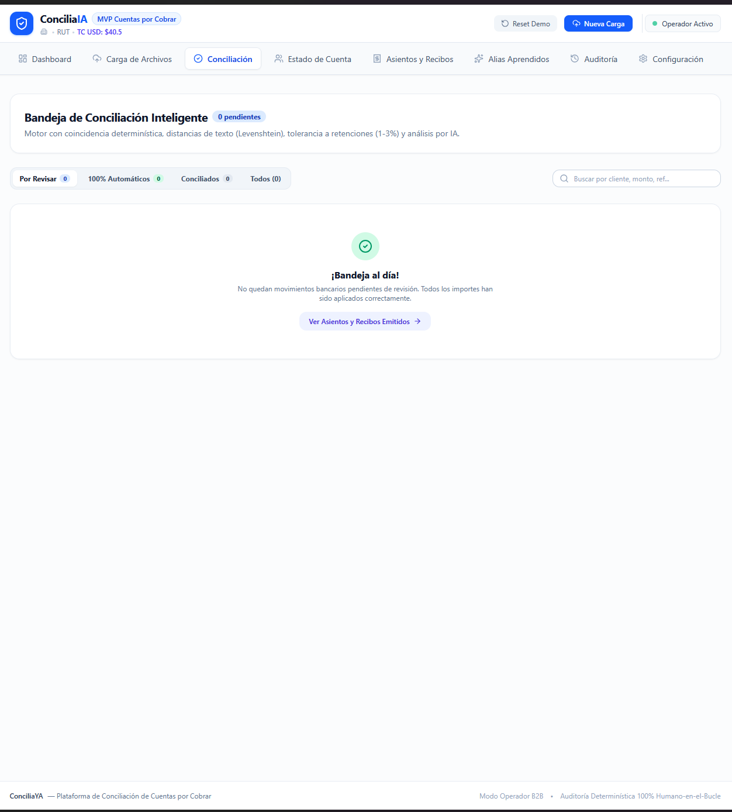
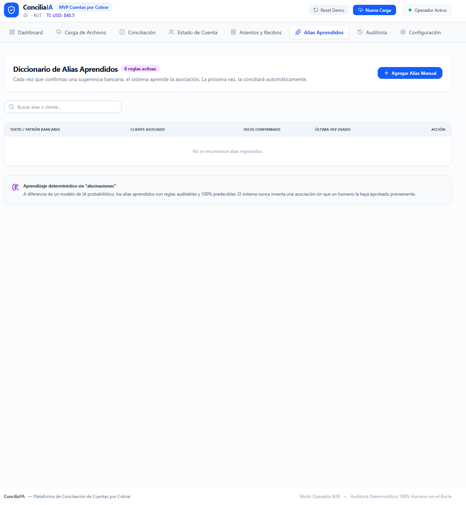
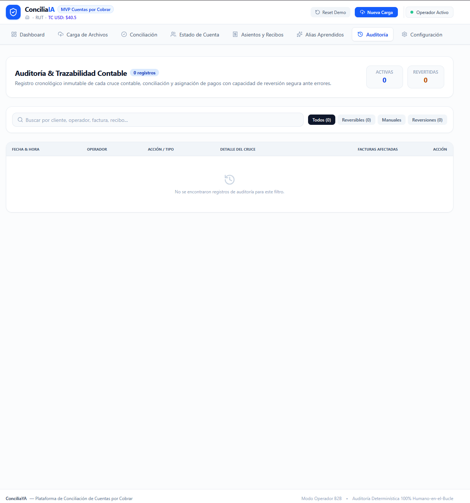
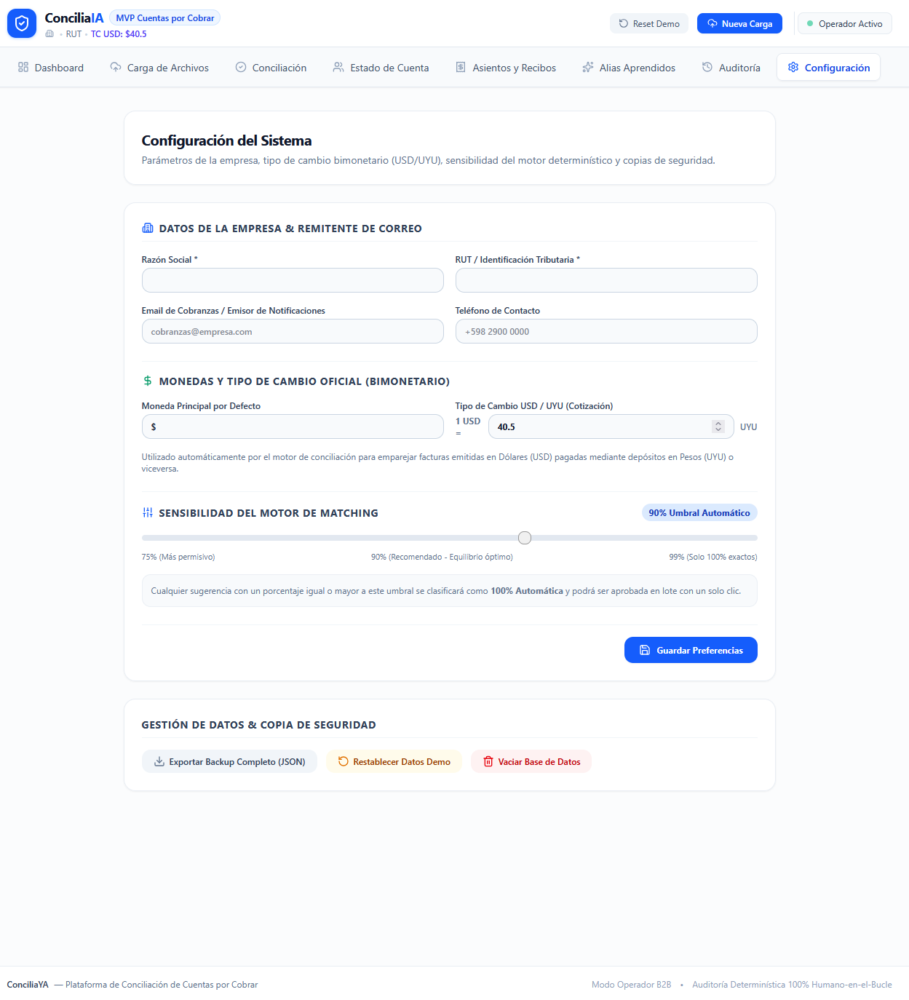

<div align="center">

# ConciliaYA

### Plataforma de Conciliación de Cuentas por Cobrar con IA

[](https://conciliaya.vercel.app)
[](https://github.com/Fernandezalejo1/conciliaya)
[](https://www.typescriptlang.org/)
[](https://react.dev/)
[](https://ai.google.dev/)

**[Probar la App en Vivo](https://conciliaya.vercel.app)**

</div>

---

## Qué es

ConciliaYA es una herramienta web para empresas distribuidoras e importadoras que automatiza la conciliación de pagos bancarios con facturas pendientes. Utiliza IA (Google Gemini) para descifrar descripciones bancarias crípticas y sugerir automáticamente el cliente y las facturas correspondientes.

## Capturas

<!-- Agregá tus screenshots acá -->
<!--  -->
<!--  -->
<!--  -->

## Características principales

- **Conciliación automática** — Motor de matching fuzzy con Levenshtein, aliases aprendidos y búsqueda por RUT/CI
- **Análisis con IA** — Gemini descifra descripciones bancarias crípticas (ej: "TRF REC SPI PAGO FAC 2100")
- **Multi-moneda** — Soporte UYU/USD con tipo de cambio configurable
- **Retenciones fiscales** — Detección automática de retenciones DGI (1-3%) y comisiones bancarias
- **Recibos oficiales** — Generación automática de recibos de cobro (REC-YYYY-NNNNN)
- **Asientos contables** — Partida doble con planes de cuentas configurables
- **Reversión segura** — Revertir cualquier conciliación con traza de auditoría completa
- **Saldos a favor** — Gestión de créditos y sobrepagos de clientes
- **Aging de cartera** — Análisis de antigüedad de deudas (al día, 1-30, 31-60, 61-90, +90 días)
- **Importación CSV** — Carga masiva de facturas y extractos bancarios
- **Exportación** — CSV de asientos contables y estados de cuenta

## Capturas de pantalla

| Dashboard | Subir Datos | Conciliación |
|:---------:|:-----------:|:------------:|
|  |  |  |

| Matching IA | Estados de Cuenta | Contabilidad |
|:-----------:|:-----------------:|:------------:|
|  |  |  |

| Auditoría | Ajustes |
|:---------:|:-------:|
|  |  |

## Stack tecnológico

| Capa | Tecnología |
|------|-----------|
| Frontend | React 19, TypeScript, TailwindCSS v4 |
| Backend | Vercel Serverless Functions |
| IA | Google Gemini 3.6 Flash |
| Build | Vite |
| Despliegue | Vercel |

## Cómo funciona el flujo

```
1. Subir facturas (CSV)          → Se cargan las facturas pendientes
2. Subir extracto bancario (CSV) → Se importan los movimientos del banco
3. Motor de matching automático  → Cruza pagos vs facturas por:
                                   - Número de factura
                                   - Monto exacto
                                   - Similitud de texto (nombre/RUT)
                                   - Aliases aprendidos
4. Revisar y confirmar           → El operador aprueba o ajusta
5. Generar recibo + asiento      → Automático al confirmar
6. Análisis IA (opcional)        → Para movimientos crípticos sin identificar
```

## Arranque rápido

### Requisitos

- Node.js 18+
- Una API key de Google Gemini (gratis en [aistudio.google.com](https://aistudio.google.com/apikey))

### Instalación local

```bash
# Clonar el repo
git clone https://github.com/Fernandezalejo1/conciliaya.git
cd conciliaya

# Instalar dependencias
npm install

# Crear archivo de entorno
echo "GEMINI_API_KEY=tu_api_key_aqui" > .env.local

# Ejecutar en desarrollo
npm run dev
```

La app se abre en `http://localhost:3000`

### Variables de entorno

| Variable | Requerida | Descripción |
|----------|-----------|-------------|
| `GEMINI_API_KEY` | Sí | API key de Google Gemini para análisis con IA |
| `PORT` | No | Puerto del servidor (default: 3000) |

## Despliegue

### Vercel (recomendado)

1. Fork o cloná el repo
2. Conectá el repo en [vercel.com](https://vercel.com)
3. Agregá la variable `GEMINI_API_KEY` en Settings → Environment Variables
4. Deploy automático

### Docker

```bash
docker build -t conciliaya .
docker run -p 3000 -e GEMINI_API_KEY=tu_key conciliaya
```

## Estructura del proyecto

```
conciliaya/
├── api/
│   └── analyze-cryptic.ts    # Serverless function para Gemini AI
├── src/
│   ├── components/            # Vistas de la aplicación
│   │   ├── DashboardView.tsx
│   │   ├── ReconciliationView.tsx
│   │   ├── UploadView.tsx
│   │   ├── AccountStatementView.tsx
│   │   ├── AccountingView.tsx
│   │   ├── LearnedAliasesView.tsx
│   │   ├── AuditView.tsx
│   │   └── SettingsView.tsx
│   ├── context/
│   │   └── ConciliaContext.tsx  # Estado global de la app
│   ├── types/
│   │   └── index.ts           # Interfaces TypeScript
│   └── utils/
│       ├── matchingEngine.ts   # Algoritmo de conciliación
│       └── fileValidation.ts
├── server.ts                  # Express server (desarrollo local)
├── vercel.json                # Configuración de Vercel
└── package.json
```

## Licencia

MIT

---

<div align="center">
Hecho en Uruguay 🇺🇾
</div>
