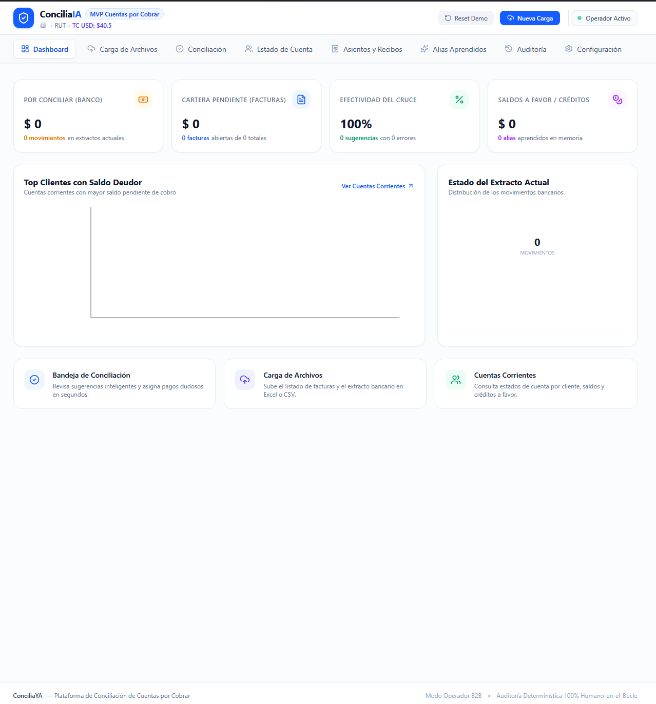
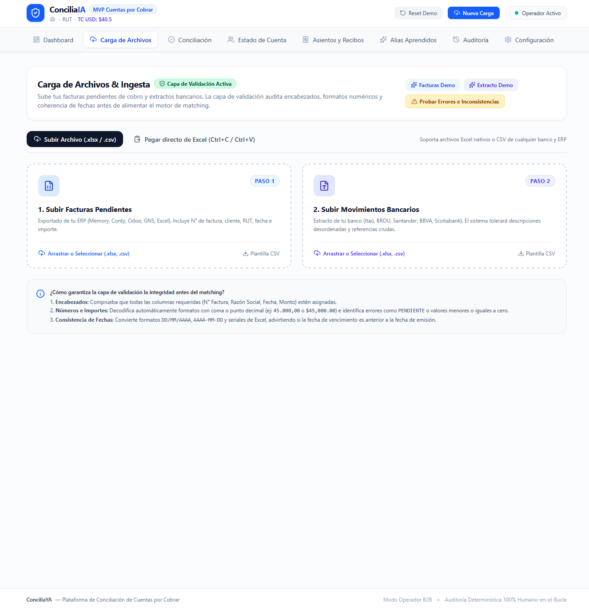
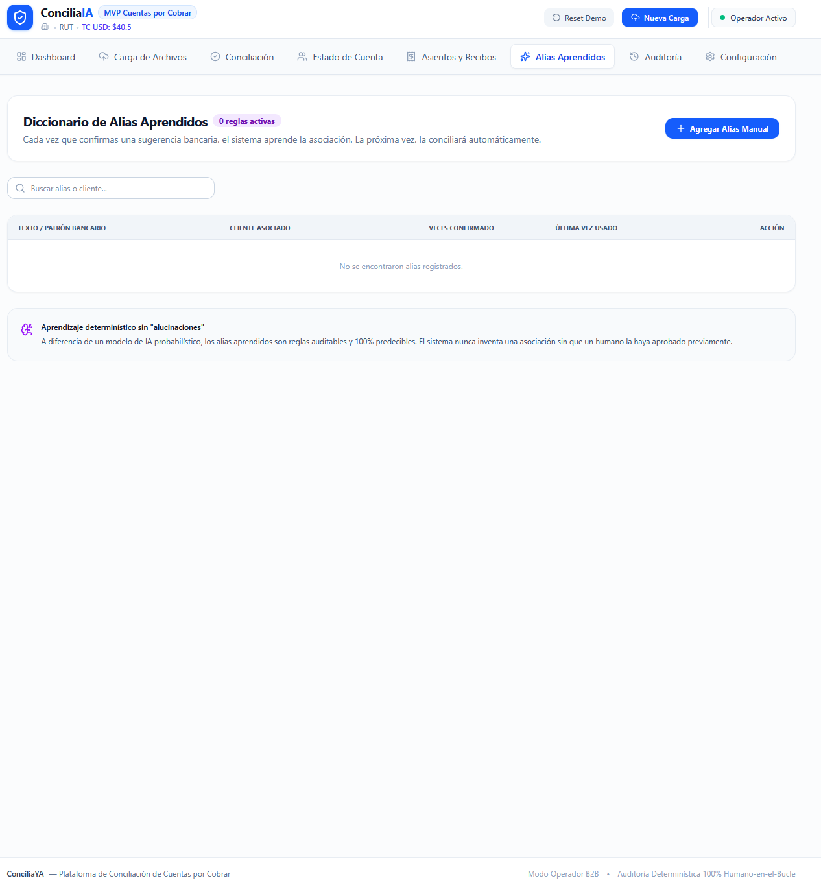
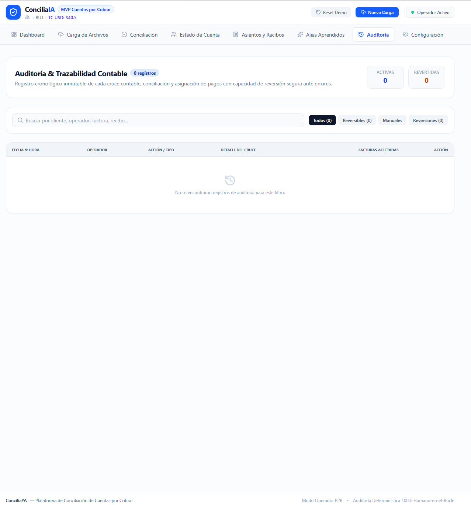
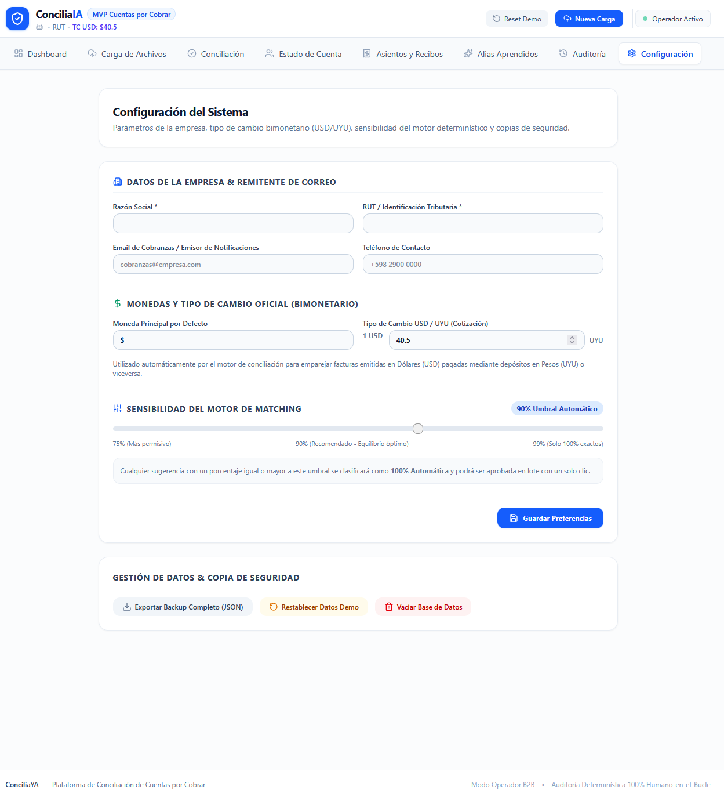

<div align="center">

# ConciliaYA

### Plataforma de Conciliación de Cuentas por Cobrar

[](https://conciliaya.vercel.app)
[](https://github.com/Fernandezalejo1/conciliaya)
[](https://www.typescriptlang.org/)
[](https://react.dev/)

**[Probar la App en Vivo](https://conciliaya.vercel.app)**

</div>

---

## Qué es

ConciliaYA es una herramienta web para empresas distribuidoras e importadoras que automatiza la conciliación de pagos bancarios con facturas pendientes. El cruce lo resuelve un **motor local determinista** (reglas, número de factura, monto, similitud de texto y alias aprendidos). No llama a servicios externos de IA ni depende de una API key para funcionar: todo el cálculo ocurre en tu navegador y con los datos que vos cargás.

## Capturas

<!-- Agregá tus screenshots acá -->
<!--  -->
<!--  -->

## Características principales

- **Conciliación automática** — Motor de matching con Levenshtein, aliases aprendidos y búsqueda por RUT/CI
- **Cruce por número de factura** — Resuelve referencias explícitas y combinaciones de facturas
- **Multi-moneda** — UYU/USD con tipo de cambio configurable; ninguna moneda se trata como equivalente a otra
- **Retenciones fiscales** — Detección automática de retenciones DGI (1-3%) y comisiones bancarias
- **Recibos oficiales** — Generación automática de recibos de cobro (REC-YYYY-NNNNN)
- **Asientos contables** — Partida doble con planes de cuentas configurables, validación de balance
- **Reversión segura** — Revertir cualquier conciliación con traza de auditoría completa
- **Saldos a favor** — Gestión de créditos y sobrepagos de clientes
- **Aging de cartera** — Análisis de antigüedad de deudas (al día, 1-30, 31-60, 61-90, +90 días)
- **Importación CSV** — Carga masiva de facturas y extractos bancarios, con rechazo de duplicados
- **Exportación** — CSV de asientos contables y estados de cuenta

## Capturas de pantalla

| Dashboard | Subir Datos | Conciliación |
|:---------:|:-----------:|:------------:|
|  |  |  |

| Cruce | Estados de Cuenta | Contabilidad |
|:-----------:|:-----------------:|:------------:|
|  |  |  |

| Auditoría | Ajustes |
|:---------:|:-------:|
|  |  |

## Stack tecnológico

| Capa | Tecnología |
|------|-----------|
| Frontend | React 19, TypeScript, TailwindCSS v4 |
| Backend | Vercel Serverless Functions + Express (local) |
| Motor | Reglas deterministas, similitud de texto y alias aprendidos (sin servicios externos) |
| Build | Vite |
| Despliegue | Vercel |

## Cómo funciona el flujo

```
1. Subir facturas (CSV)          → Se cargan las facturas pendientes
2. Subir extracto bancario (CSV) → Se importan los movimientos del banco
3. Motor de matching automático  → Cruza pagos vs facturas por:
                                   - Número de factura
                                   - Moneda y tipo de cambio
                                   - Monto exacto o combinación de facturas
                                   - Similitud de texto (nombre/RUT)
                                   - Aliases aprendidos
4. Revisar y confirmar           → El operador aprueba o ajusta
5. Generar recibo + asiento      → Automático al confirmar, en una sola operación
```

Los casos ambiguos quedan marcados para revisión humana: el motor no los resuelve por orden ni por proximidad.

## Arranque rápido

### Requisitos

- Node.js 18+

### Instalación local

```bash
# Clonar el repo
git clone https://github.com/Fernandezalejo1/conciliaya.git
cd conciliaya

# Instalar dependencias
npm install

# Crear archivo de entorno con la contraseña de acceso
echo "APP_PASSWORD=tu_contraseña" > .env.local

# Ejecutar en desarrollo
npm run dev
```

La app se abre en `http://localhost:3000`

### Comandos

```bash
npm run dev      # Servidor de desarrollo
npm run lint     # Chequeo de tipos
npm test         # Pruebas del motor, importación y sesión
npm run build    # Compila interfaz y servidor
npm run check    # lint + test + build, todo junto
npm start        # Arranca el build de producción
```

### Variables de entorno

| Variable | Requerida | Descripción |
|----------|-----------|-------------|
| `APP_PASSWORD` | Sí | Contraseña de acceso al panel. Sin ella el login responde 503 |
| `SESSION_SECRET` | No | Firma de las cookies de sesión (usa `APP_PASSWORD` si no se define) |
| `PORT` | No | Puerto del servidor (default: 3000) |

## Despliegue

### Vercel (recomendado)

1. Fork o cloná el repo
2. Conectá el repo en [vercel.com](https://vercel.com)
3. Agregá `APP_PASSWORD` (y `SESSION_SECRET`) en Settings → Environment Variables
4. Deploy automático

### Docker

```bash
docker build -t conciliaya .
docker run -p 3000 -e APP_PASSWORD=tu_contraseña conciliaya
```

## Estructura del proyecto

```
conciliaya/
├── api/
│   ├── auth.ts                  # Sesión firmada para Vercel
│   └── analyze-cryptic.ts       # Responde 410: el análisis externo se eliminó
├── src/
│   ├── components/              # Vistas de la aplicación
│   │   ├── DashboardView.tsx
│   │   ├── ReconciliationView.tsx
│   │   ├── UploadView.tsx
│   │   ├── AccountStatementView.tsx
│   │   ├── AccountingView.tsx
│   │   ├── LearnedAliasesView.tsx
│   │   ├── AuditView.tsx
│   │   └── SettingsView.tsx
│   ├── context/
│   │   └── ConciliaContext.tsx  # Estado global de la app
│   ├── types/
│   │   └── index.ts             # Interfaces TypeScript
│   └── utils/
│       ├── ledger.ts            # Núcleo contable: confirmar, revertir, importar
│       ├── money.ts             # Monedas, conversión y redondeo
│       ├── storage.ts           # Validación y respaldo del libro
│       ├── matchingEngine.ts    # Algoritmo de conciliación
│       └── fileValidation.ts    # Parseo de archivos
├── server/
│   └── auth.ts                  # Sesión firmada con cookie HttpOnly
├── server.ts                    # Express server (desarrollo local)
├── tests/                       # Pruebas del motor real
├── vercel.json                  # Configuración de Vercel
└── package.json
```

## Pruebas

```bash
npm test
```

Cubren pagos exactos, parciales y sobrepagos; conversión UYU↔USD en ambas direcciones; retenciones y comisiones; confirmaciones repetidas; reversión con IVA; reimportaciones; deduplicación de movimientos; y firma de sesiones. `npm run check` ejecuta tipos, pruebas y build en una sola tanda.

## Contribuir

1. Fork el repo
2. Creá una rama (`git checkout -b feature/nueva-funcionalidad`)   
3. Hagan commit (`git commit -m 'Agregar nueva funcionalidad'`)
4. Push a la rama (`git push origin feature/nueva-funcionalidad`)
5. Abrí un Pull Request

## Licencia

MIT

---

<div align="center">
Hecho en Uruguay 🇺🇾
</div>
